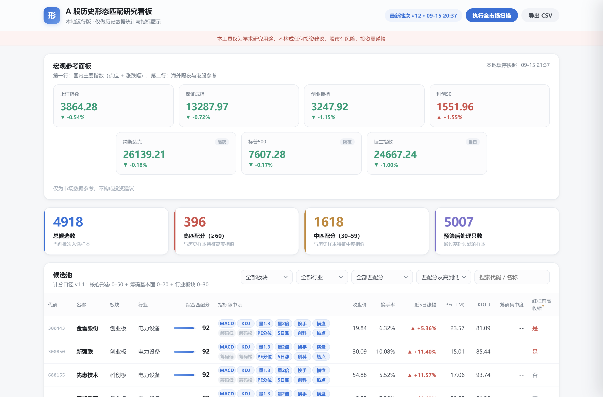

# A-Share Pattern Lab · A股历史形态匹配研究看板

[](LICENSE)
[](https://www.python.org/)
[](https://fastapi.tiangolo.com/)
[](#测试)

> 一个**仅限本地运行**的 A 股历史数据研究工具：对全市场历史行情做技术指标计算与形态特征匹配度打分，并以可视化看板展示。
>
> 分数只回答一个问题：**这只股票当前的指标形态，与历史上上升段启动样本的特征有多相似。**
> 它不回答，也无法回答：未来会不会涨。

---

## ⚠️ 免责声明（请先阅读）

- 本工具**仅对 A 股历史公开数据做统计研究**，所有输出（包括形态匹配分、指标、图表）均为历史统计结果，**不构成任何形式的投资建议或操作指引**。
- **历史数据不等于未来表现。** 形态匹配分代表当前个股与历史上升段启动样本的特征相似程度，**不代表未来上涨概率**，更不构成对未来走势的任何承诺。
- 本工具**不提供**任何投资建议，**不输出**操作指引，**不具备**自动交易、券商接口下单、模拟交易撮合能力，**不包含**任何收益承诺或概率承诺。
- 使用本工具产生的一切后果由使用者自行承担。市场有风险，研究需谨慎。

## 项目定位

**这是一个：**

- ✅ 全市场历史行情数据的本地采集与 SQLite 缓存工具
- ✅ 技术指标计算引擎（MACD(3,6,3)、KDJ(9,3,3)、均线、量能统计，参数口径统一可查）
- ✅ 基于明确量化规则的形态匹配度打分系统（规则完全透明，见下文）
- ✅ 可视化研究看板（候选池、指标明细、K线与指标联动图、行业分布）
- ✅ 量化研究学习与工程实践的教学样本（测试覆盖、模块化、文档化）

**这不是一个：**

- ❌ 选股软件 / 操作指引生成器
- ❌ 自动交易或半自动交易工具（不对接任何券商接口，无任何下单能力）
- ❌ 付费服务、策略售卖、社群引流工具
- ❌ 云服务（**仅限本地运行，请勿将本服务部署到公网或对外提供服务**）

## 功能特性

- **打分体系 v1.1**：总分 100 三大模块——核心形态匹配（50）+ 筹码与基本面（20）+ 行业与板块（30）；热点行业名单可编辑（`config/hot_industries.json`），规则详见 [打分规则](#打分规则v11总分-100三大模块)
- **申万一级行业分类**：行业主源为申万一级行业成分（31 个行业，东财/新浪行业板块依次补缺），独立「代码-名称-行业-板块」对照表，行业与板块字段无空值
- **全市场扫描**：一次扫描覆盖沪市主板 / 深市主板 / 创业板 / 科创板全部股票（自动剔除北交所、ST/*ST/退市整理、停牌、次新）
- **指标口径统一**：MACD(3,6,3)、KDJ(9,3,3)（通达信 SMA 递推口径）、前复权价格，与常见行情软件一致
- **增量数据缓存**：收盘后扫描时当日 K 线由行情快照直接补全，无需逐股拉取历史；自动检测除权除息导致的前复权漂移并全量重拉；支持离线重算（`scripts/rescore_v11.py`，不重新拉取K线）
- **筹码集中度（可选）**：可选抓取筹码分布数据参与打分；接口缺失时对应项自动计 0 分，流程不中断
- **打分完全透明**：每一分的来源（命中/未命中）逐项可查，详见 [打分规则](#打分规则v11总分-100三大模块)
- **宏观参考面板**：国内四大指数 + 纳斯达克/标普500/恒生指数参考展示（不参与个股打分），行情源异常时自动回退本地缓存快照
- **市场资讯（只聚合不解读）**：聚合公开财经快讯并按关键词归入「国内资讯 / 海外资讯 / 宏观资讯」三类，列表卡片展示（标签 · 标题 · 来源 · 时间 · 原文链接）；抓取失败时展示「资讯暂不可用」占位，不影响主表格
- **研究看板**：克制的 Apple 风格单页应用（浅灰白底、低饱和蓝强调色、柔和涨跌色），本地打包 ECharts（离线可用），K 线 / 均线 / 成交量 / MACD / KDJ 四区联动
- **结果导出**：候选池一键导出 CSV（UTF-8 BOM，Excel 直接打开不乱码）
- **REST API**：全部功能均有对应接口，自带交互式文档（`/docs`）
- **测试覆盖**：指标计算与手工递推逐值对照、规则边界用例、端到端管线、接口测试

## 界面预览

> 以下为本机运行截图，数据为本地缓存的真实全市场扫描结果（候选 4918 只）。

### 1. 首页总览

顶部导航（项目名 / 本地运行版副标题 / 最新批次时间 / 扫描与导出按钮）、通栏红色免责声明、
宏观参考面板（国内 4 大指数 + 海外港股 3 指数，两行卡片等宽居中）、统计概览卡与候选池主表格：



### 2. 个股明细抽屉

点击候选池任意一行展开：上方为综合匹配分与三模块小计，中部按「核心形态分 / 筹码基本面分 /
行业板块分」三组列出逐项得分（命中项高亮、每组标注小计），
下方为前复权 K 线 / 均线 / 成交量 / MACD(3,6,3) / KDJ(9,3,3) 四区联动图：


### 3. 候选池行业分布

横向条形图，行业分类口径为**申万一级行业**（31 个），命中热点名单的行业以柔和暖色区分：


### 4. 市场资讯

页面底部为列表卡片式资讯模块（非大图信息流），顶部标签可按「全部 / 国内资讯 / 海外资讯 /
宏观资讯」切换；每条展示分类标签、标题、来源、时间与原文链接：


## 快速开始

### 环境要求

- Python 3.10+（开发环境为 3.13）
- Windows / macOS / Linux 均可
- 可访问东方财富公开行情接口的网络（数据源为 AKShare 免费接口，无需付费数据）

### 安装

```bash
git clone https://github.com/<your-name>/a-share-pattern-lab.git
cd a-share-pattern-lab

# 建议使用虚拟环境
python -m venv .venv
# Windows
.venv\Scripts\activate
# macOS / Linux
source .venv/bin/activate

pip install -r requirements.txt
```

### 首次扫描（建立本地缓存）

```bash
# 盘后运行（建议 15:30 之后）；首次全市场约 5-15 分钟，取决于网络
python scan.py

# 调试：仅处理预筛后前 20 只
python scan.py --limit 20

# 只扫描指定板块（逗号分隔代码前缀，30=创业板 68=科创板 60=沪市主板 00=深市主板）
python scan.py --boards 30,68

# 同时抓取筹码集中度（耗时显著增加，接口缺失时对应项自动计 0 分）
python scan.py --with-chips

# 忽略缓存全量重拉
python scan.py --full-refresh
```

扫描支持**增量续传**：K 线数据边拉取边写入本地缓存（每 200 只提交一次），
即使中途异常终止，重新运行时已有缓存的股票自动走增量路径，不会重复拉取。

扫描完成后输出统计（高匹配分数量 / 中匹配分数量 / 总候选数），并导出 CSV 到 `output/` 目录。

### 板块扫描（只扫指定板块）

全市场扫描耗时较长时，可只扫描指定板块用于快速验证打分逻辑。板块按代码前缀识别：
`60` 沪市主板、`00` 深市主板、`30` 创业板、`68` 科创板（`KEEP_CODE_PREFIXES` 可配置）。

**方式一：命令行**

```bash
# 只扫描创业板 + 科创板（适合快速验证打分逻辑）
python scan.py --boards 30,68

# 只扫描科创板
python scan.py --boards 68

# 板块扫描同时抓取筹码集中度
python scan.py --boards 30,68 --with-chips
```

**方式二：REST API**

```bash
curl -X POST "http://127.0.0.1:8000/api/scan/run?boards=30,68"
```

**方式三：看板界面**

点击右上角「执行全市场扫描」展开扫描面板 → 在「扫描范围」中选择
（全市场 / 创业板 + 科创板 / 创业板 / 科创板 / 沪市主板 / 深市主板）→ 点击「开始」。

> 板块扫描与全市场扫描共用同一套本地 K 线缓存：已缓存的个股自动走增量路径，
> 因此「先跑板块验证打分逻辑、再补全全市场」不会重复拉取历史数据。

### 启动研究看板

```bash
# 方式一：扫描完成后直接启动
python scan.py --serve

# 方式二：单独启动（读取本地缓存数据）
python -m uvicorn app.main:app --host 127.0.0.1 --port 8000
```

浏览器打开 `http://127.0.0.1:8000` 即可。

> **重要**：服务仅绑定 `127.0.0.1`，仅限本机访问。请勿修改监听地址对外提供服务。

### 开发预览（合成数据）

不依赖真实数据即可查看看板效果（写入独立的临时数据库）：

```bash
python dev_preview.py --port 8765
```

## 打分规则（v1.1，总分 100，三大模块）

> 计算口径：MACD(3,6,3)、KDJ(9,3,3)、价格采用前复权。所有参数集中于 `app/config.py`。
> 规则完整说明另见 [docs/project_report.md](docs/project_report.md)。

### 第一步：基础过滤（不满足直接剔除，不计分）

| # | 规则 | 说明 |
|---|------|------|
| 1 | 剔除 ST、*ST、退市整理股票 | 按证券简称关键词识别 |
| 2 | 上市天数 ≥ 365 天 | 沪深交易所上市日期接口，失败时按本地 K 线窗口估计 |
| 3 | 当日非停牌 | 当日成交额 > 0 |
| 4 | 剔除北交所股票 | 仅保留 60/68/00/30 开头 |

### 第二步：核心形态匹配分（0–50 分）

| # | 条件 | 分值 |
|---|------|------|
| 1 | MACD(3,6,3) 金叉且红柱大于 0（DIF > DEA 且 MACD柱 > 0） | +15 |
| 2 | KDJ(9,3,3) 金叉且 J 值小于 100（K > D 且 J < 100） | +12 |
| 3 | 量能达标：当日成交量 > 1.3 × 近5日均量 | +8 |
|   | 量能翻倍：当日成交量 > 2 × 近5日均量（与上项叠加） | +5（量能满分 13） |
| 4 | 换手率健康度：当日换手率处于 [3%, 15%] 区间 | +5 |
| 5 | 前期横盘：近40个交易日最高价/最低价 ≤ 1.8 | +5 |

### 第三步：筹码与基本面加分（0–20 分）

| # | 条件 | 分值 |
|---|------|------|
| 1 | 筹码集中度 ≤ 18% | +3 |
|   | 筹码集中度 > 20%（在 3 分基础上再加 5 分，满分 8；缺失计 0 分） | 至 8 |
| 2 | PE 行业分位：低于所属行业 30% 分位 +6；30%-70% 分位 +3；高于 70% 或缺失 0 | 0–6 |
| 3 | 5日涨幅健康度：近5日涨幅处于 [5%, 20%] 区间 | +6 |

> PE 行业分位口径：免费接口无行业 3 年历史 PE 序列，采用同行业当日截面分位近似
> （行业有效样本 < 5 时计 0 分）；PE 为市盈率 TTM。

### 第四步：行业与板块加分（0–30 分）

| # | 条件 | 分值 |
|---|------|------|
| 1 | 板块属性：创业板（30 开头）/ 科创板（68 开头） | +8 |
| 2 | 热点行业加成：所属行业命中热点名单（可编辑 `config/hot_industries.json`，保存后下次扫描/重算自动生效） | +22 |

**综合匹配分 = 核心形态分（0–50）+ 筹码基本面分（0–20）+ 行业板块分（0–30），范围 0–100 分。**

### 宏观参考面板（仅展示，不参与个股打分）

- 国内：上证指数、深证成指、创业板指、科创50
- 海外/港股参考：纳斯达克、标普500（隔夜）、恒生指数（当日）
- 行情源不可用时自动回退最近一次成功快照（本地缓存），并标注数据时间。

### 附加展示字段（仅展示，不参与打分，不做任何判断）

| 字段 | 说明 |
|------|------|
| MACD红柱相对前高收缩 | 布尔值。定义为：当日红柱 > 0 且回看窗口（不含当日）内柱最大值 > 0 且当日柱 < 前高。**历史见顶相关指标，仅供研究** |
| KDJ-J 值 | 当日 J 值 |
| 筹码集中度 | 最近交易日 90 日成本集中度 |
| 当日换手率 | 来自行情快照 |
| PE(TTM) | 市盈率 TTM（腾讯行情） |
| 近5日涨幅 | 最新收盘 / 5个交易日前收盘 − 1 |

### 分数含义

综合匹配分表示**当前个股与历史上升段启动样本的特征相似程度**：

- 分数高 = 当前形态与历史样本的启动前特征相似度高
- 分数**不表示**未来上涨概率，不构成任何操作指引
- **历史数据不等于未来表现**

## 市场资讯模块

页面底部的「市场资讯」只做**聚合与归类**：内容为第三方公开财经快讯的原文标题与链接，
本工具不生成、不评论、不解读任何资讯，也不参与个股打分。

### 三个分类口径

| 分类 | 涵盖内容 | 判定关键词（节选） |
|------|----------|--------------------|
| 国内资讯 | A 股动态、上市公司公告、行业政策、流动性相关 | A股、沪指、上市公司、减持、回购、公告、龙虎榜… |
| 海外资讯 | 美股、纳斯达克、标普 500、美联储、港股、中概股、海外公司与地缘 | 美股、纳斯达克、美联储、恒生、中概股、海外国别与公司名… |
| 宏观资讯 | 经济数据、货币与财政政策、大宗商品定价 | 央行、社融、CPI、PPI、PMI、LPR、统计局、WTI、布伦特… |

判定顺序为「境内市场强特征 → 海外 → 宏观 → 国内兜底」，因此
「美联储加息落地 A 股三大指数集体高开」这类跨域标题会归入国内资讯。
分类为**关键词启发式**，仅用于辅助浏览，不保证逐条准确。

### 数据源与降级

依次尝试东方财富全球快讯 → 同花顺 → 财联社 → 富途牛牛 → 新浪财经，
任一源可用即采用，多源结果按标题指纹去重；结果写入本地缓存（默认 30 分钟）。
**全部源失败时接口返回 `available=false` 与「资讯暂不可用」**，
前端展示占位提示，不影响候选池、筛选、导出等主功能。

### 中性化过滤

为保持本项目的措辞规范，标题含交易指令类表述的资讯条目会被整条跳过
（词表见 `app/config.py` 的 `NEWS_BLOCK_PARTS`，以片段拆分存储）。
如需完整保留第三方原文，将该元组清空即可。

> 资讯为第三方公开内容，不代表本工具观点，不构成任何形式的操作指引。

## API 一览

启动服务后访问 `/docs` 查看交互式文档。核心接口：

| 方法 | 路径 | 说明 |
|------|------|------|
| POST | `/api/scan/run` | 触发扫描（后台执行，支持 `with_chips` / `full_refresh` / `limit` / `boards`，如 `boards=30,68` 仅扫描创业板+科创板） |
| GET | `/api/scan/status` | 扫描进度与最近批次统计 |
| GET | `/api/pool/` | 候选池列表（支持匹配分下限 / 行业 / 板块 / 排序 / 分页） |
| GET | `/api/pool/export` | 导出候选池 CSV |
| GET | `/api/pool/industries` | 候选池覆盖的行业列表 |
| GET | `/api/pool/{code}` | 单只个股日K与指标序列（MACD/KDJ/MA），并随附该股档案与三模块得分明细（`profile` / `score`） |
| GET | `/api/market/indices` | 宏观参考面板：国内指数 + 海外/港股指数快照（含缓存兜底） |
| GET | `/api/market/industry-stats` | 候选池按行业统计 |
| GET | `/api/market/board-stats` | 候选池按板块统计 |
| GET | `/api/news` | 市场资讯聚合（`category=all/domestic/overseas/macro`，`limit` 控制条数；源不可用时返回 `available=false`） |

所有接口返回纯统计数据与指标展示，不含任何操作指引类描述。

## 项目结构

```
a-share-pattern-lab/
├── scan.py                  # 命令行扫描入口（支持 --boards 板块扫描）
├── dev_preview.py           # 开发预览（合成数据，不污染真实数据）
├── app/
│   ├── main.py              # FastAPI 应用入口（仅绑定 127.0.0.1）
│   ├── config.py            # 全部量化参数与路径配置（一处可调）
│   ├── indicators.py        # 指标纯计算：MACD / KDJ / MA / 量能统计
│   ├── scoring.py           # 基础过滤 + v1.1 三模块打分引擎
│   ├── data_source.py       # AKShare 封装：统一重试与容错降级
│   ├── db.py                # SQLite 缓存层：增量更新、结果存储
│   ├── scanner.py           # 扫描编排：主线程读写库，线程池仅做网络 IO
│   ├── routers/
│   │   ├── pool.py          # 候选池 / CSV导出 / 个股明细
│   │   ├── scan_api.py      # 扫描触发 / 状态轮询
│   │   ├── market.py        # 指数 / 行业板块统计
│   │   └── news.py          # 市场资讯聚合与关键词归类
│   └── static/              # 前端看板（原生 HTML/CSS/JS + 本地打包 ECharts）
├── config/
│   └── hot_industries.json  # 热点行业名单（可编辑，前缀匹配）
├── scripts/
│   ├── backfill_profiles.py # 行业/板块对照表回填
│   ├── refresh_industry.py  # 独立刷新行业映射并回写 stocks（输出覆盖率）
│   ├── rescore_v11.py       # 离线重算打分（保留K线缓存，不重新拉取）
│   ├── start_server.py      # 重启本地看板服务（仅绑定 127.0.0.1）
│   └── word_check.py        # 措辞合规自检
├── docs/
│   ├── project_report.md    # 规则详解、数据源降级与前端实现说明
│   └── screenshots/         # 界面截图
├── tests/                   # 单元测试 + 端到端管线测试 + 接口测试
├── data/                    # 本地数据库（gitignore，不入库）
└── output/                  # CSV 导出目录（gitignore，不入库）
```

## 技术实现要点

- **增量更新策略**：已有缓存的个股，当日 K 线由行情快照直接构造追加（避免逐股历史请求）；快照「昨收」与缓存最近收盘价的相对误差超过 0.1% 时（多为除权除息导致的前复权价跳变），自动全量重拉该股，保证全市场前复权口径一致
- **线程模型**：SQLite 连接仅在主线程读写；网络请求（历史K线、筹码）在线程池并发执行，结果统一回主线程落库，规避 SQLite 并发写问题
- **容错降级**：任一数据接口失败仅影响对应个股或对应字段（如筹码缺失计 0 分），单点失败不扩散、不中断整体扫描
- **参数集中**：全部指标参数、过滤阈值、分值、缓存时效集中于 `app/config.py`，修改口径无需触碰业务代码

## 数据来源与口径

- 行情数据：[AKShare](https://github.com/akfamily/akshare) 免费公开接口（东方财富等公开数据源），仅用于个人研究，请遵守数据源方的使用条款
- 价格口径：前复权
- 指标口径：MACD(3,6,3)，红绿柱 = 2 × (DIF − DEA)；KDJ(9,3,3)，SMA 采用通达信递推口径
- 筹码集中度：90 日成本集中度（`stock_cyq_em`），可选数据
- 市场资讯：东方财富 / 同花顺 / 财联社 / 富途牛牛 / 新浪财经的公开快讯接口（依次降级），仅展示第三方原文标题与链接

## 测试

```bash
pip install -r requirements-dev.txt
pytest tests/ -v
```

测试覆盖：

- 指标计算与手工递推结果逐值对照（MACD / KDJ / SMA / 量能 / 红柱前高）
- 打分规则边界用例（放量 1.3 倍、筹码 18% / 20%、J 值 100、横盘 1.8 等）
- 基础过滤全分支（ST / 次新 / 停牌 / 北交所）
- 筹码数据缺失容错（对应项计 0 分，流程不中断）
- 端到端管线（扫描 → 打分 → 落库 → CSV 导出 → 增量幂等）
- 行情源降级（东财 → 腾讯 / 新浪）、行业口径归一化（证监会行业 → 申万一级）
- 资讯分类规则、时间与标题归一化、多源去重、中性化过滤、源失败降级
- API 接口与看板页面

## 使用边界与合规声明

- ✅ 允许：clone 代码后在**自己本地电脑**运行，用于个人量化研究与学习
- ❌ 禁止：将本服务部署到公网、对外提供服务、封装为商业产品
- ❌ 禁止：基于本工具从事证券投资咨询业务（该业务在中国境内需持牌经营）
- ❌ 本仓库不接受、不链接任何付费推广、策略售卖、社群引流入口

## 版本历史

| 版本 | 主要变更 |
|------|----------|
| v1.4.0 | **视觉体系整体收敛**：改为浅灰白 / 米白 / 极浅蓝灰背景 + 深石墨黑标题 + 低饱和蓝强调色；卡片统一白色微冷白底、12–16px 圆角、极轻阴影；标题更轻、关键数字更粗；涨跌改用柔和红 / 柔和绿；表格改为轻表头、极浅分隔线（去斑马纹）、命中标签统一胶囊形。**新增市场资讯模块**：聚合公开财经快讯并按关键词归入国内 / 海外 / 宏观三类，列表卡片展示，多源降级 + 本地缓存，源失败时展示「资讯暂不可用」且不阻塞主表格；标题含交易指令类表述的条目中性化跳过。行业分布图配色同步柔和化 |
| v1.3.0 | 阶段2 布局与视觉升级：宏观面板两行等宽居中、统计卡统一高度与左侧色条、候选池表头吸顶 + 固定列宽行高 + 命中标签统一尺寸、模块统一收进容器；修复候选池候选数大幅缩水（腾讯源当日 K 线缺成交额被误判停牌）、详情档案取到空批次、行业「其他」占比过高、首页被指数接口冷启动阻塞四项根因；详情抽屉改为三组得分明细（含小计）与图表实例复用 |
| v1.2.0 | 看板布局整体优化：顶部导航区（项目名/副标题/最新批次时间/扫描与导出按钮）+ 通栏红色免责声明；宏观参考面板拆分为「国内 4 指数 + 海外港股 3 指数」双行；统计概览卡分档配色；候选池表格与指标命中标签视觉精修；行业分布图精度优化；**修复个股明细抽屉图表无法渲染的问题**（多 grid 布局下坐标轴 gridIndex 缺失导致渲染异常）；详情接口随附档案与得分明细；措辞自检词表扩充交易导向类表述 |
| v1.1.1 | 行业分类升级为**申万一级行业**（31 个，东财/新浪依次补缺），候选池行业「其他」占比归零；SQLite 连接增加 `busy_timeout`；首页 `no-cache` + 静态资源版本号，根治浏览器缓存旧脚本 |
| v1.1.0 | 打分体系重写为三模块 100 分制（核心形态 50 + 筹码基本面 20 + 行业板块 30）；新增 PE(TTM) 与 PE 行业分位；新增海外/港股指数展示；热点行业名单可编辑 |
| v1.0.0 | 首个可用版本：全市场扫描 + 数据缓存 + 形态匹配打分（0–60 / 0–40 两段式）+ 研究看板 + API |

## 路线图

- [x] 第一阶段：后端数据层 + 打分引擎 + API
- [x] 第二阶段：Web 研究看板
- [x] 第三阶段：开源打包与文档
- [ ] 回测统计模块：对历史样本做规则命中的事后统计（仅供研究）
- [ ] 多参数口径对比研究

## 贡献

欢迎 Issue 与 Pull Request。提交前请：

1. 运行 `pytest tests/` 确保全部通过
2. 遵守本项目的措辞规范：界面、文档、代码中不出现证券咨询类表述
3. 新增功能需附带测试

## License

[MIT](LICENSE)
